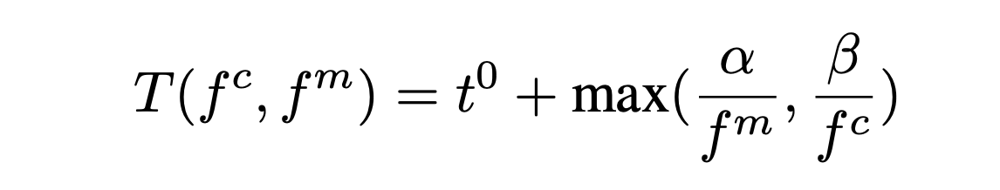

Inefficiency - dynamic information - hardware counters
Inaccuracy - static information like PTX/SASS 

Do they take overhead of adjusting frequency into account when making decisions?

Strong correlation between performance counters and execution-time/power
Profiling overhead is high because requires multiple replays (?)
Static analysis of PTX or SASS (gpu assembly)

DCGM - lightweight lightweight gpu monitor
Performs online predictions - No run before to make prediction

DVFS on GPU hard because both core and memory frequency to adjust, their model:

where \alpha memory frequency scaling sensitivity
      \beta core frequency scaling sensitivity 

## Conclusions

They focus on overhead from obtaining dynamic information - they use DCGM
They focus on overhead from the prediction model - they use relatively lightweight models
Their model takes into account the sensitivity to core and memory frequency for making a prediction, it also takes into account what we are optimizing for: performance/performance & energy / energy
They do not need to run the application before to take
